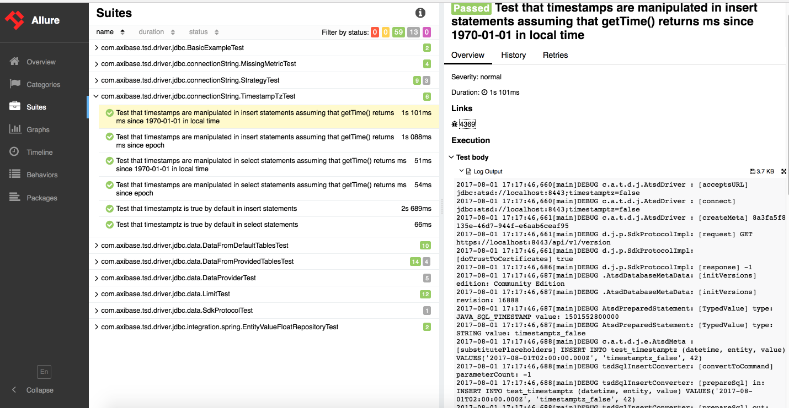

[](https://travis-ci.org/axibase/atsd-jdbc-test)
[](https://www.codacy.com/app/anton-rib/atsd-jdbc-test?utm_source=github.com&amp;utm_medium=referral&amp;utm_content=axibase/atsd-jdbc-test&amp;utm_campaign=Badge_Grade)
[](http://www.apache.org/licenses/LICENSE-2.0)

# Integration tests for JDBC driver

- [Run tests with local ATSD](#run-tests-with-local-atsd)
- [Run tests with ATSD in a Docker container](#run-tests-with-atsd-in-a-docker-container)

## Requirements

- Java 1.8

## Run tests with local ATSD

```bash
$ mvn clean test
```

To run tests, you have to choose (or create) your own ATSD metrics. A test phase requires a set of test properties listed below. You need to fill the file `src/main/resources/dev.properties` with your metrics. The following properties are required.

```properties
axibase.tsd.driver.jdbc.url=<ATSD_URL | host:port | >
axibase.tsd.driver.jdbc.username=<ATSD_LOGIN>
axibase.tsd.driver.jdbc.password=<ATSD_PASSWORD>
axibase.tsd.driver.jdbc.metric.tiny=<TEST_METRIC_NAME>
axibase.tsd.driver.jdbc.metric.tiny.count=<TEST_METRIC_EXPECTED_RECORDS>
```

See also:

- [Custom JUnit Rules](#custom-junit-rules)
- [Exposed parameters](#exposed-parameters)
- [Generate report and run on localhost](#generate-report-and-run-on-localhost)

## Run tests with ATSD in a Docker container

The tests are built automatically by Travis CI, but you also can run it manually.

Launch `run_tests_in_container.sh` in the `atsd-jdbc-test` base directory.

```bash
./run_tests_in_container.sh DOCKER_PUBLISH_PORTS TEST_OPTIONS
```

> A set of test properties are already specified, i.e. ones from `src/main/resources/dev.properties` are filled automatically

Parameter `DOCKER_PUBLISH_PORTS` is required, you can specify HTTPS and TCP ports or use "--publish-all" (in this case Docker finds free ports automatically):

```bash
./run_tests_in_container.sh "--publish-all"
./run_tests_in_container.sh "-p1234:8443 -p4321:8081"
```

`TEST_OPTIONS` is not required, but must be specified in double quotes if used. See [exposed parameters](#exposed-parameters).

> In a preparation step, `run_tests_in_container.sh` launches ATSD instance with pre-installed `m_small` (100 samples), `m_large` (500 000 samples) metrics and user `axibase` with password `axibase`

See also:

- [Custom JUnit Rules](#custom-junit-rules)
- [Exposed parameters](#exposed-parameters)
- [Generate report and run on localhost](#generate-report-and-run-on-localhost)

### Generate report and run on localhost

```bash
$ mvn allure:report jetty:run -Djetty.port=1234
```



### Custom JUnit Rules

- `OutputLogsToAllure(boolean enable)` -- redirect logging to allure attachments
- `SkipTestOnCondition` -- allows to skip test if required system variable is not set. Tests with required variables must be annotated with the `ExecuteWhenSysVariableSet` annotation which has a string parameter -- required system variable. This annotation is repeatable.

### Exposed parameters

The following parameters can be specified on test execution, for example:

```bash
mvn clean test -Dinsert.wait=500
```

```bash
./run_tests_in_container.sh "--publish-all" "-Dinsert.wait=500 -Doutput.redirect.allure=true"
```

Parameter | Supported Values | Example Value | Description
------------|-------------|------------|-----------
`output.redirect.allure` | `true` or not set | `true` | Redirect per-test execution logging to allure attachment. Works only for tests with [`OutputLogsToAllure`](#custom-junit-rules) rule enabled
`allure.link.issue.pattern` | string with `{}` placeholder | `https://localhost/redmine/issues/{}` | Pattern for generating links to bug tracking system
`insert.wait` | integral number, default is 1000 | `5000` | Waiting timeout in milliseconds between insert and subsequent select statement
